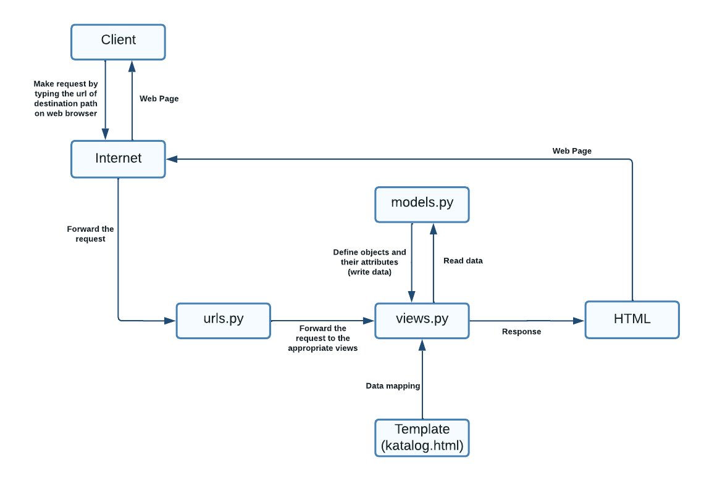

## Link Heroku App

Link aplikasi Django yang sudah di-deploy ke Heroku: [https://django-assignment-elsa.herokuapp.com/katalog/](https://django-assignment-elsa.herokuapp.com/katalog/)

## Bagan

## Virtual Environment

*Virtual environment* digunakan untuk mengisolasi suatu proyek Django sehingga proses *development* yang dilakukan hanya mempengaruhi proyek yang sedang di-*deploy* saja dan tidak mempengaruhi proyek lainnya. Selain itu, *virtual environment* juga berguna untuk menjaga agar proyek yang satu dan yang lain tidak tercampur. *Virtual environment* memungkinkan untuk menjalankan aplikasi sesuai dengan versi Django yang digunakan dalam proses *development* walaupun versi Django yang ter-*install* pada perangkat berbeda. Proses pembuatan aplikasi tetap bisa dilakukan tanpa *virtual environment*, tetapi hal ini memungkinkan terjadinya *clash* dan *error-error* lainnya akibat perbedaan versi Django yang digunakan. Oleh karena itu, sangat dianjurkan untuk menggunakan *virtual environment* agar proyek Django dapat berjalan dengan baik.

## Cara Implementasi

Skema model yang telah dibuat pada file models.py di folder katalog dimigrasi ke dalam *database* Django lokal dengan menjalankan perintah `python manage.py makemigrations` dan `python manage.py migrate`. Perintah tersebut akan menghasilkan file 0001_initial.py. Selanjutnya, perintah `python manage.py loaddata initial_catalog_data.json` dijalankan untuk memasukkan data yang telah ditulis pada file .json tersebut ke dalam *database* Django lokal.

Pada file views.py di folder katalog, saya menambahkan `import class CatalogItem` dari `models.py` di folder `katalog`. Kemudian, saya membuat sebuah fungsi `show_catalog` yang menerima parameter `request` dan mengembalikan hasil *render* sebuah halaman HTML (katalog.html). Pada fungsi `show_catalog(request)` terdapat variabel `data_catalog` yang berupa QuerySet dari object CatalogItem dan variabel `context` yang berupa dictionary pasangan key-value yang akan digunakan pada konfigurasi file HTML. 

Pada file urls.py di folder katalog, saya melakukan `import path` dari `django.urls` dan `import show_catalog` dari `katalog.views` untuk melakukan *routing*. Kemudian, didefinisikan ‘katalog’ pada variabel `app_name`. Ditambahkan juga variabel `urlpatterns` yang berupa list path hasil pemanggilan fungsi `path('', show_catalog, name='show_catalog')`. Kemudian, pada variabel `urlpatterns` di file urls.py di folder project_django ditambahkan `path('katalog/', include('katalog.urls'))`. Hasil dari proses *routing* ini adalah jika dibuka pada `http://localhost:8000/katalog/` atau link aplikasi akan menampilkan hasil *render* dari fungsi `show_catalog(request)` yang ada pada file views.py. 

File HTML digunakan sebagai *template* pemetaan hasil data. Konfigurasi HTML ini menggunakan *key* pada *dictionary* yang telah didefinisikan pada file views.py untuk menampilkan *value* dari *key* yang sesuai pada tampilan aplikasi. Pada file katalog.html di folder template, `Fill me!` diganti menjadi `{{name}}` dan `{{npm}}`. Kemudian, saya melakukan *for loop* untuk menampilkan *attributes* dari tiap data `catalog` yang ada pada `list_catalog`.

Sebelum melakukan *deployment* aplikasi ke Heroku, saya membuat aplikasi herokuapp terlebih dahulu. Lalu, saya menambahkan *repository secret* dengan pasangan Name-Value, yaitu `HEROKU_APP_NAME-(Value)` dan `HEROKU_API_KEY-(Value)`. Kemudian, saya melakukan `re-run all jobs` dan aplikasi berhasil di-*deploy* ke Heroku. Hasil *deployment* aplikasi dapat dilihat pada *link* yang ada pada *section* [Link Heroku App](https://github.com/elsagiana/django-assignment/tree/main/katalog#link-heroku-app).
