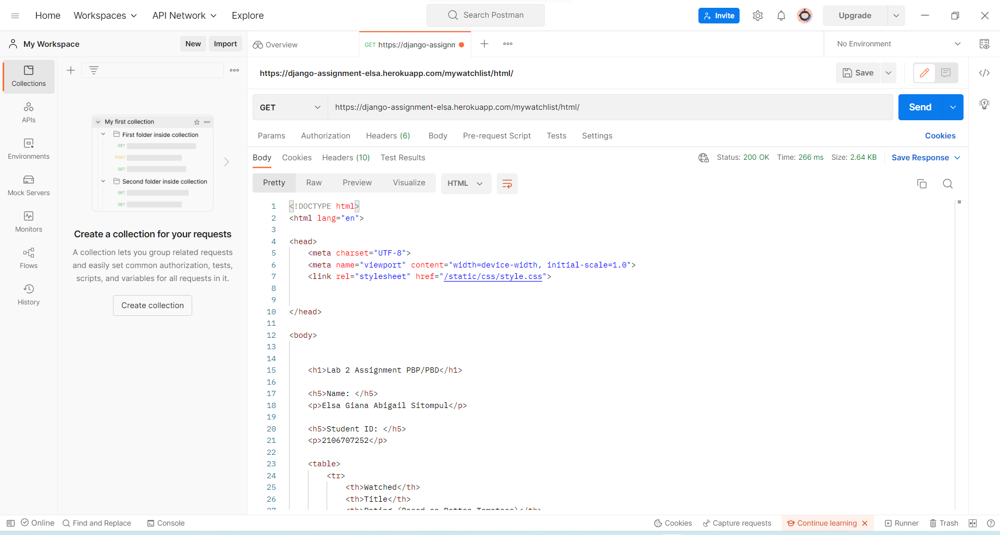
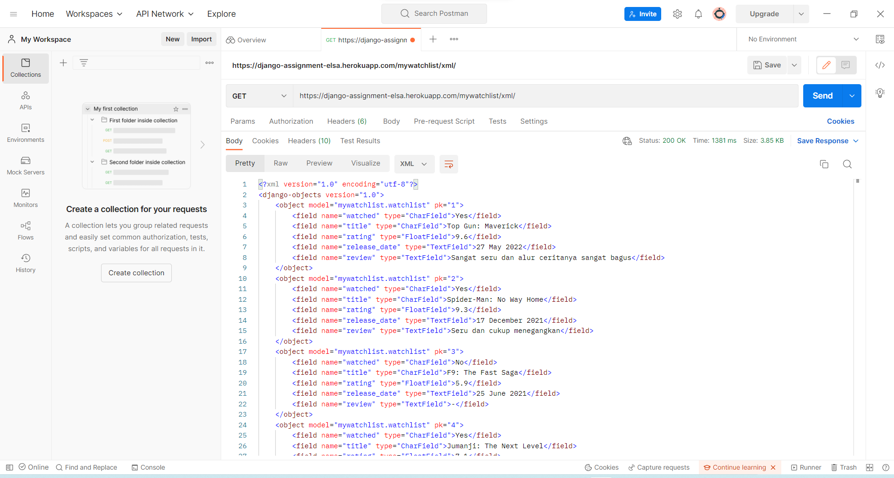
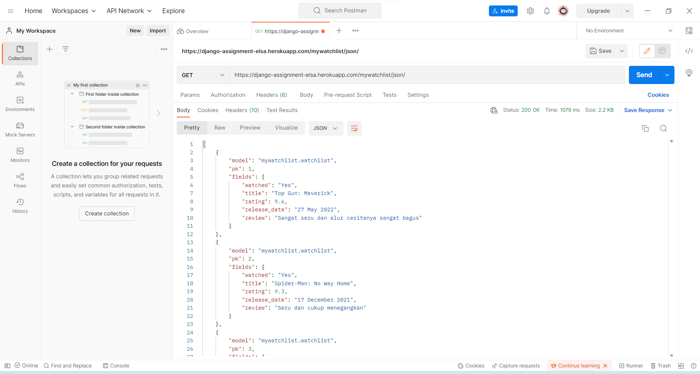

## Link Heroku App

Link aplikasi Django yang sudah di-deploy ke Heroku: 
[https://django-assignment-elsa.herokuapp.com/mywatchlist/](https://django-assignment-elsa.herokuapp.com/mywatchlist/)

HTML: [https://django-assignment-elsa.herokuapp.com/mywatchlist/html/](https://django-assignment-elsa.herokuapp.com/mywatchlist/html/)

XML: [https://django-assignment-elsa.herokuapp.com/mywatchlist/xml/](https://django-assignment-elsa.herokuapp.com/mywatchlist/xml/) 

JSON: [https://django-assignment-elsa.herokuapp.com/mywatchlist/json/](https://django-assignment-elsa.herokuapp.com/mywatchlist/json/)

## Perbedaan JSON, XML, dan HTML

JSON(JavaScript Object Notation) merupakan data delivery yang didesain menjadi self-describing. JSON memiliki tampilan yang mudah untuk dimengerti oleh bahasa manusia. JSON tidak mengawali dan mengakhiri tampilan data dengan tag(<>).

XML(Extensible Markup Language) merupakan data delivery yang didesain menjadi self-descriptive. XML akan menampilkan atribut tiap objek secara jelas dengan tetap mengawali dan mengakhiri tampilan data dengan tag (<>). 

HTML(HyperText Markup Language) merupakan data delivery yang digunakan untuk menampilkan data. HTML bersifat statis. Tampilan file HTML tetap menggunakan tag(<>) namun jika dibuka pada link tampilan HTML tidak ada tag-nya dan mudah untuk dilihat.

## Alasan Diperlukannya Data Delivery

Data delivery diperlukan untuk mengirimkan data dari satu stack ke stack lainnya. Format data delivery yang umum adalah HTML, XML, dan JSON.

## Cara Implementasi
Pertama, saya membuat app baru bernama mywatchlist dengan menjalankan perintah `python manage.py startapp mywatchlist`. Lalu, saya mendaftarkan app tersebut pada variabel INTALLED_APPS yang ada pada settings.py di folder project_django. Kemudian, saya membuat model pada models.py yang ada pada folder mywatchlist. Saya membuat class Watchlist yang didalamnya berisi field atribut data. Lalu, saya membuat initial_watchlist_data.json yang berisi 10 data objek MyWatchList yang memiliki atribut watched, title, rating, release_date, dan review. Kemudian, saya menjalankan perintah `python manage.py makemigrations` dan `python manage.py migrate`untuk memigrasi skema model yang telah dibuat pada file models.py di folder mywatchlist ke dalam *database* Django lokal. Lalu, saya menjalankan perintah `python manage.py loaddata initial_watchlist_data.json` untuk memasukkan data yang telah ditulis pada file .json ke dalam *database* Django lokal. Selanjutnya, pada folder templates saya membuat file mywatchlist.html yang berisi tampilan format HTML jika link aplikasi dipanggil.

Pada file views.py di folder mywatchlist, saya menambahkan `from mywatchlist.models import WatchList`. Saya juga menambahkan `from django.http import HttpResponse` dan `from django.core import serializers`.Kemudian, saya membuat sebuah fungsi `show_mywatchlist` yang menerima parameter `request` dan mengembalikan hasil *render* dari sebuah halaman HTML (mywatchlist.html). Pada fungsi `show_mywatchlist(request)` terdapat variabel `data_watchlist` yang berupa QuerySet dari object watchList dan variabel `context` yang berupa dictionary pasangan key-value yang akan digunakan pada konfigurasi file HTML. Selain itu, saya juga membuat fungsi `show_mywatchlist_xml` yang menerima parameter `request` yang akan menampilkan data dalam format XML dan fungsi `show_mywatchlist_json` yang menerima parameter `request` yang akan menampilkan data dalam format JSON.

Pada file urls.py di folder mywatchlist, saya menambahkan kode `from django.urls import path` dan `from mywatchlist.views import show_mywatchlist, show_mywatchlist_xml, show_mywatchlist_json` untuk melakukan *routing*. Kemudian, didefinisikan ‘mywatchlist’ pada variabel `app_name`. Ditambahkan juga variabel `urlpatterns` yang berisi list path berikut, `path('', show_mywatchlist, name='show_mywatchlist')`, `path('html/', show_mywatchlist, name='show_mywatchlist')`, `path('xml/', show_mywatchlist_xml, name='show_mywatchlist_xml')`, `    path('json/', show_mywatchlist_json, name='show_mywatchlist_json')`. Kemudian, pada variabel `urlpatterns` di file urls.py di folder project_django ditambahkan `path('mywatchlist/', include('mywatchlist.urls'))`. Jika dibuka pada link `http://localhost:8000/mywatchlist/` atau link aplikasi akan menampilkan hasil *render* dari fungsi `show_mywatchlist(request)` yang ada pada file views.py. Jika diakhir link tersebut ditambahkan `xml/` maka akan tampil data dengan format XML atau jika ditambahkan `json/` maka akan tampil data dengan format JSON.

Selanjutnya, saya melakukan push ke Git dan secara otomatis aplikasi Heroku ter-deploy dan aplikasi dapat diakses melalui *link* yang ada pada *section* [Link Heroku App](https://github.com/elsagiana/django-assignment/tree/main/mywatchlist#link-heroku-app).

## Screenshot Postman

Screenshot Postman HTML

Screenshot Postman XML

Screenshot Postman JSON
